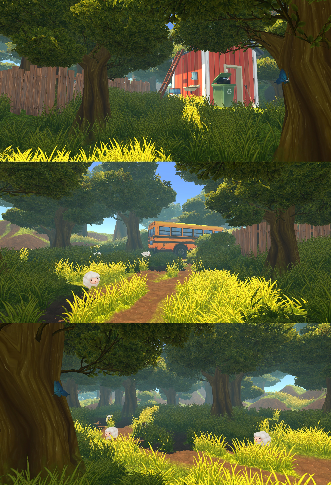

# Meditation in the Backyard

## Descriptions

The artwork we create in Project II is called “Meditation in the Backyard”. In this virtual world, players will immerse themselves in a peaceful moment. They can search for interactive objects in a realistic environment, stimulating their senses of realism to the scene. The sounds of chirping sheep and fluttering butterflies create a serene atmosphere, allowing players to experience the ease and joy of nature. This virtual artwork can evoke players' emotions and imagination. It is a spiritual journey that will bring you inspiration and unparalleled feelings.

## Technologies

- Unity basic tech stack
- VR headset and controller interaction development
- 3D environment lighting rendering techniques
- Text animation effect UI

We awarded the best project in the CCST9049 course!

## References

- Animals models: [Poly Art Animal Icons](https://assetstore.unity.com/packages/2d/gui/icons/poly-art-animal-icons-195035)
- Bird nest model: [Low Poly Bird Nests](https://assetstore.unity.com/packages/3d/props/low-poly-bird-nests-229812)
- Forest map: [Poly Coniferous Forest](https://assetstore.unity.com/packages/3d/environments/poly-coniferous-forest-277464)
- Sound effects: [Pixabay Sound Effects](https://pixabay.com/sound-effects/search/sparrow/?pagi=2)
